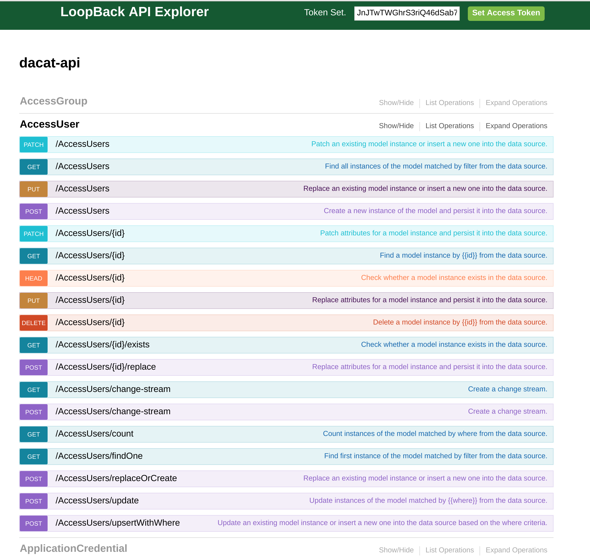
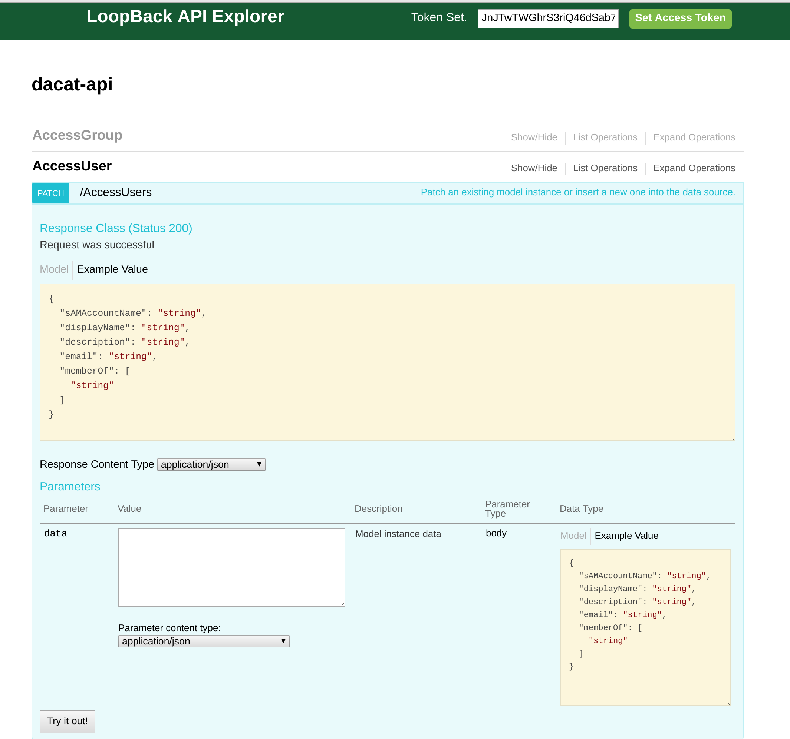
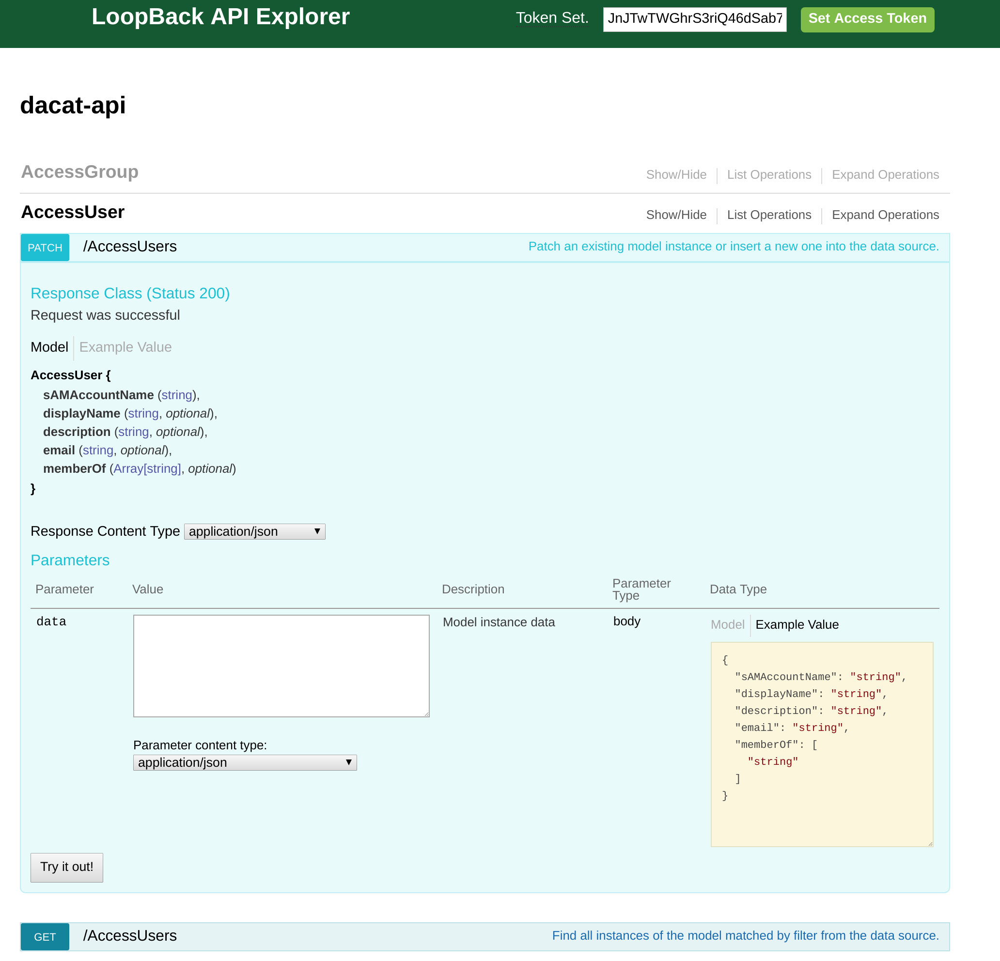

# An Introduction to the Data Model

## Model

There are many models within the catalog and many of them are self explanatory. The API server creates routes for creation, retrieval, modification and deletion. However, it is worth explaining the core models that are used.

TODO Add up-to-date data model graph

## Relationships and Access

Most models inherit the ownable base model which regulates access based on the ownerGroup/ accessGroups fields. Relationships are defined by including the ID of the respedtive model (handled by loopback model definitions)

## RawDataset

This is a dataset that has been collected from an experiment. It contains details about who owns it, contact information etc. Most importantly, it contains `Scientific Metadata`, and this is an extensible object to outline all parameters relevant to the dataset.

## DerivedDataset

These are datasets that are created after an experiment (i.e. active beamtime) and are subsequently derived. Typically, they contain information on the analysis of a dataset.

The nuance of this definition is ultimately up to the user.

### OrigDatablocks and Datablocks
Describes the actual data files, including file name, size and ownership.

Datablocks describes data as it is stored in an archive system (on tape), whereas OrigDatablocks describes the data as it is split during initial ingestion.

More Info: 

A data block should never be shown to the user but, regardless of backup system being used, it is likely that a single dataset will be able to be backed up into a single location. In order to address this, we have `datablocks` that contain a list of datafiles. A dataset can be split into multiple datablocks (unless it contains a single large file).

To reduce the reliance on a particular backup system, there is an `OrigDataBlock` and a `DataBlock`. The `OrigDataBlock` is created by Catamel  when a dataset is ingested and they are preemptively split. If the connected backup system does support datablocks then it would need to respond with datablock details when it is ingested. In those cases, a dataset will store both the `OrigDataBlocks` and `Datablocks`.

### DatasetLifecycle

There are many temporal operations for a dataset and they do not need to be stored inside the model. This model contains information relating to the status of the dataset but not the metadata itself. The archive location, date that it should become public and information about archiving or retrieval. Technically the DatasetLifecycle is however `embedded` into the Dataset documents

## Job

When a user wants to archive or retrieve a dataset, a job is created. A job queue can then collect these and send them to whichever backup system is being used. As the job progresses, the system can make calls back that update the `Job Status Message` and, when necessary, the DatasetLifecycle can be updated.

---

## Explorer

When you have an instance of the data catalog running, the API endpoints and the related data models can be looked at at the following URL:

* <CATAMEL_URL>/explorer/

The API explorer is a feature of Loopback and allows one to test various endpoints. This section outlines the core functionality. The first point to note is that requests require a token. You can use the `login` route under the `User` tab to obtain one of these, or use a CURL command.

### Main Screen

The top right entry field is where the token should be included. The token will define your access rights, so not all routes will be accessible. Each model has a tab which relates to its endpoint. Expanding the tab shows the routes section below.

### Routes

Each section outlines the routes for the chosen model. This is configurable but the HTTP verbs are supported here for most routes and conform to the standards. Error codes are also consistent. Expanding the chosen route allows one to test the response with sample data, or their own.

### Single Route

Selecting a route shows the expected JSON object and provides an editor to allow you to test the route. Response information is shown below.
Clicking the `data type` box will insert it into your request for easy testing.

### Model

The model view can be accessed by clicking the link next to `Example Value` and shows the fields that Loopback is expecting to receive, as well as their type and whether they are required.

