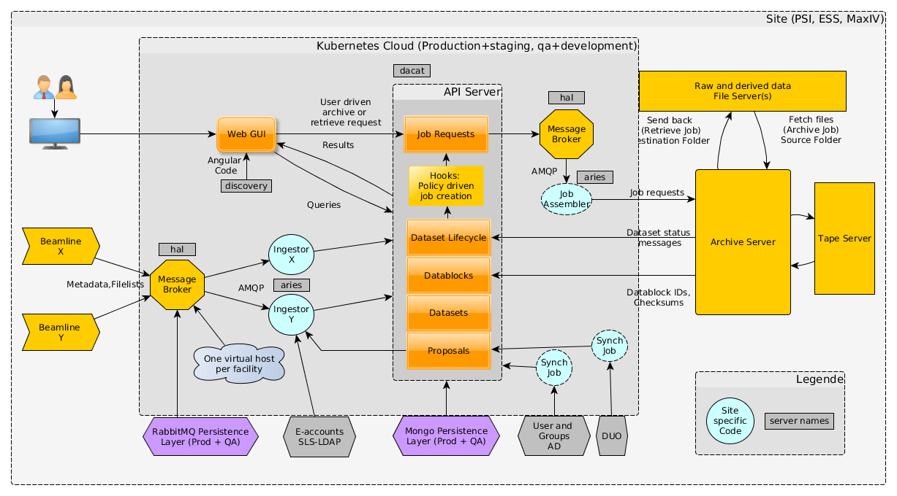

# SciCat Data Catalogue Developer Guide

**TODO Update all sections, in particular all screenshots**

SciCat is a data catalogue web application that provides a searchable interface for datasets, a method of publishing DOIs, as well as the option to carry out actions (i.e. archiving and publishing) and acts as a place to reference datasets used in publications.

This guide aims to help developers and system admins understand some of the SciCat components.

SciCat is built on micro services using the following stack:

## Web Browser Client (Catanie)

* node
* npm
* typescript
* angular
* NGRX
* loopback SDK generator

## API (Catamel)

* node
* js
* loopback
* mongoDB

The diagram below describes the key components of SciCat. The flow of ingested information is is described as follows: Beamline script send a package of minimal metadata (e.g. a dataset) to the message broker. The broker passes the dataset onto a NodeRed layer that is responsible for calling the responsible API endoint. 

Hooks trigger other activities. For example, if a new proposal is ingested, a new entry in policy is required. The policy will dictate how any dataset associated with that proposal will behave with regards to automatic archiving, publishing etc.

