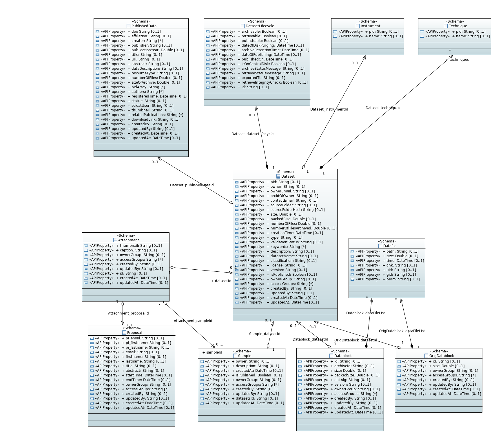
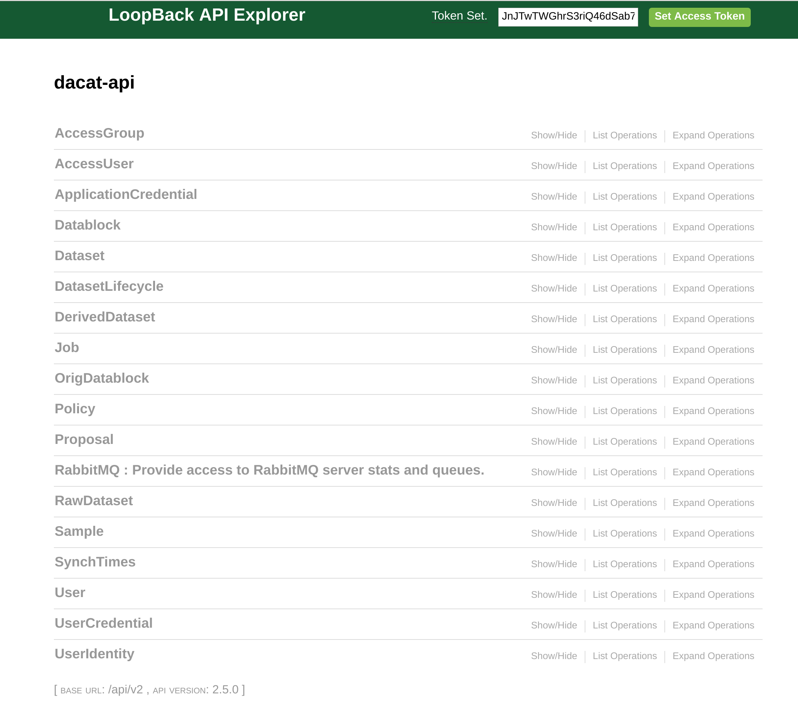

# An Introduction to the Data Model

## Model

There are many models within the catalog and many of them are self explanatory. The API server creates routes for creation, retrieval, modification and deletion. However, it is worth explaining the core models that are used.

The following graph shows a simplified class diagramm of the main model classes. It was generated semi-automatically from the swagger.json file using the [WAPIml tool](https://github.com/opendata-for-all/wapiml)

## The Ownable Base model

Most models inherit the ownable base model which regulates access based on the ownerGroup/ accessGroups fields. Relationships are defined by including the ID of the respective model (handled by loopback model definitions)

## Dataset

This is the base class for all datasets, and is derived from the
Ownable model.  There are two classes that are derived from Dataset:
[RawDataset](#rawdataset) and [DerivedDataset](#deriveddataset).

The data model and its API endpoints are described [here](https://scicatproject.github.io/api/#operation/Dataset.create)

## RawDataset

This is a dataset that has been collected from an experiment. It contains details about who owns it, contact information etc. Most importantly, it contains `Scientific Metadata`, and this is an extensible object to outline all parameters relevant to the dataset.

Each raw dataset may contain a link to a single Proposal.

The data model and its API endpoints are described [here](https://scicatproject.github.io/api/#operation/RawDataset.create)

## Instrument

This collection is meant to store the available measurement instruments, ideally in a globally unique naming scheme (within the Expands/Panosc EU programs standardization on these topics is pursued). Datasets can link to these instruments (in addition to the creationLocation field), allowing for more detailed information about the measurement devices.

The data model and its API endpoints are described [here](https://scicatproject.github.io/api/#operation/Instrument.create)

## Technique

This collection is meant to store the available measurement techniques, ideally in a globally unique naming scheme (within the Expands/Panosc EU programs standardization on these topics is pursued). Datasets can link to these techniques, allowing for more detailed information about the measurement method applied

## DerivedDataset

These are datasets that are created by analyzing the data in raw datasets. The fields allow to link both to the raw data files used in the analysis as well as to a software repository which keeps the source code used for the analysis, thus helping to keep track of the provenance of the data. You can add ScientificMetadata here as well.

Although DerivedDataset does not contain a link to a Proposal, it may
be deduced.  A corresponding Proposal may be found by identifying all
input RawDatasets (either directly or indirectly via other
DerivedDatasets) from the inputDatasets field.  These RawDatasets may
contain links to the corresponding Proposal.

The data model and its API endpoints are described [here](https://scicatproject.github.io/api/#operation/DerivedDataset.create)

### OrigDatablocks and Datablocks
Describes the actual data files, including file name, size and ownership. A given Dataset can have many (orig)Datablocks depending on the number of files and the sizes of the files.

`Datablocks` describes data as it is stored in an archive system (on tape), whereas `OrigDatablocks` describes the data as it is split during initial ingestion. Therefore you should always add the OrigDataBlock information when ingesting, whereas the Datablocks information is optional and would be filled by the archive system, when it did its work of writing chunks of data to tape. E.g. a Datablock can correspond to a single tar file which is written to tape and the contents of the Datablock is essentially the file listing of the tar file.

The data model and its API endpoints are described [here](https://scicatproject.github.io/api/#operation/OrigDatablock.create) and [here](https://scicatproject.github.io/api/#operation/Datablock.create)

### DatasetLifecycle

There are many temporal operations for a dataset describing what happens to the Dataset during its lefetime. Therefore this model contains information relating to the status of the dataset but not the metadata itself. The archive location, date that it should become public and information about archiving or retrieval. Technically the DatasetLifecycle is however `embedded` into the Dataset documents.

The data model and its API endpoints are therefore described as part of the Dataset model 

## Job

When a user wants to archive, retrieve or publish a dataset, a job is created. The new Job entry is automatically forwarded to a Message Broker, e.g. RabbitMQ, from where it can be picked up by any program willing to react to this Job. E.g. at PSI the RabbitMQ queue is emptied by a Node-RED process, which reads the Job information from the RabbitMQ queue. ALternatively you can use other Messaging solutions, such as Apache Kafka. In this way the (site specific) logic to handle the Jobs is kept outside the core of the SciCat system, giving a greater degree of flexibility. The external systems should ideally respond with Status updates to the Job model, when there job is finished. E.g. as the job progresses, the system can make PUT/PATCH API calls back that update the `Job Status Message` and, when necessary, also the individual status of the involved datasets by updating the DatasetLifecycle information.

The data model and its API endpoints are described [here](https://scicatproject.github.io/api/#operation/Job.create) 

## Proposals

A proposal is a written intention declaration of what kind of measurement people want to perform when and where. Such information is often available in an existing system outside of the data catalog, like digital user office systems for institutes which offer their instruments to other users.

This information can be synchronized into SciCat and facilitates the definition of the ownership of the datasets as well as providing information relevant for publication of data, such as principal investigators, abstracts etc. datasets are normally uniquely associated with one proposal.

The proposal information is however optional

The data model and its API endpoints are described [here](https://scicatproject.github.io/api/#operation/Proposal.create) 

## PublishedData

When Datasets are published you assign a DOI to a **list** of datasets. The PublishedData model keeps track of these information, i.e which dataset is being published, authorship, abstract and download links to access the corresponding file contents of the datasets.

The data model and its API endpoints are described [here](https://scicatproject.github.io/api/#operation/PublishedData.create) 

## UserSettings

This collection stores user preferences, such as the list of pre-selected columns in the dataset dashboard view, defaults for the table page size etc.

The data model and its API endpoints are described [here](https://scicatproject.github.io/api/#operation/UserSetting.create) 

## Attachment

Various of the above mentioned models can have files (usually images) attached. The size is limited to 16MB for one attachment.

The data model and its API endpoints are described [here](https://scicatproject.github.io/api/#operation/Attachment.create) 

---

## Explorer

When you have an instance of the data catalog running, the API endpoints and the related data models can be looked at at the following URL:

* <BACKEND_URL>/explorer/
* [Example instance from ESS](https://scicat.ess.eu/explorer/)

The API explorer is a feature of Loopback and allows one to test various endpoints. This section outlines the core functionality. The first point to note is that requests require a token. You can use the `login` route under the `User` tab to obtain one of these, or use a CURL command.

### Main Screen

The top right entry field is where the token should be included. The token will define your access rights, so not all routes will be accessible. Each model has a tab which relates to its endpoint. Expanding the tab shows the routes section below.

### Routes

Each section outlines the routes for the chosen model. This is configurable but the HTTP verbs are supported here for most routes and conform to the standards. Error codes are also consistent. Expanding the chosen route allows one to test the response with sample data, or their own.

### Single Route

Selecting a route shows the expected JSON object and provides an editor to allow you to test the route. Response information is shown below.
Clicking the `data type` box will insert it into your request for easy testing.

### Model

The model view can be accessed by clicking the link next to `Example Value` and shows the fields that Loopback is expecting to receive, as well as their type and whether they are required.

