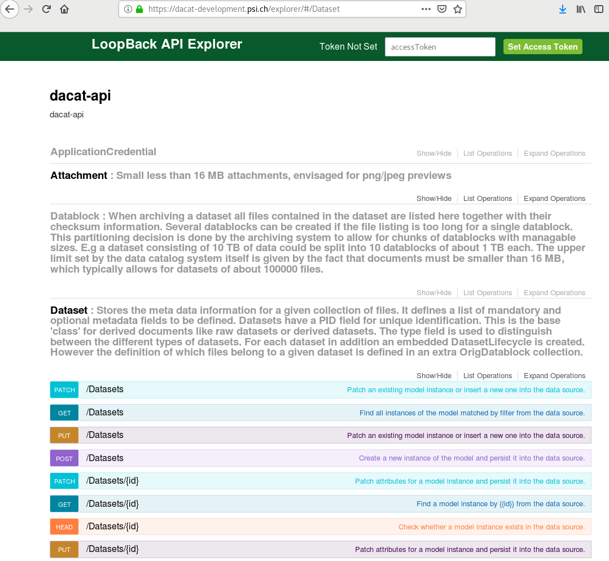

# Step by Step manual to Setup SciCat without Containers

## Setup Backend (catamel)

### Mongo

The first part is to setup a Mongo DB, if not yet existing. You will need at least version 3.4 . In the simplest case a simple
```
yum install mongodb-server
```
(on RedHat systems) or similar will suffice.

A production ready setup however may require to setup a replicated DB server. Follow the Mongo DB Manuals in this case. E.g. at PSI we operate a 3 fold relicated Mongo DB server.


#### Hint to add full text indexing

Mongo DB needs to work with Indices to speed up the queries. All of these index definitions are created automatically, with one exception. This exception is described here: the following command must be executed **after** the database has been created in MongoDB, i.e. after starting catamel once.

Log into mongodb at the console, e.g. run 


1. If not using Kubernetes
```
mongo dacat
```

or, if using Kubernetes

```
kubectl exec -it <mongo container> mongo dacat
```
and enter

```javascript
db.Dataset.createIndex( { "$**": "text" } )
```

Note: If the index is not created as above, catanie e2e test fails.

### API Server

#### Prerequisites

First you need to have node/npm installed

```
npm version 6 or higher
Node version 10 or higher
```
The needed database will be created automatically when the API server starts. 

#### Get code
```
git clone https://github.com/SciCatProject/catamel.git
cd catamel
git checkout master # (or develop)
npm install
```

Please note: the master branch is often quite behind the development, therefore to get all new features you may want to use the develop branch instead.

#### Setup configuration
 
There are 5 configuration files that need to be adjusted to your situation. There are example configuration files for each of the 4 configuration files inside the server directory

1. `functionalAccounts.json` : defines the functional accounts, such as admin, ingestor etc
2. `datasources.json` : defines the connection to the Mongo DB -sample datasources.json
3. `providers.json` : defines the authentication source for user accounts, e.g. how to link to your local LDAP/AD server
4. `config.local.js` : defines the API server details, API root address, your local site name and policy settings for , the PID prefix for your datasets, the type of message broker to use, the connection to an email send server etc
5. `component-config.json`: defines the Express framework components, in particular if the *explorer* is enabled and optionally definition of the RabbitMQ topology, if used.

Adjusting these settings to your infrastructure should be straight forward. In case you do not understand a setting just leave it at its default.


#### Start metadata server
```
npm run start
```

#### Test functionality

```
npm run test
```

You can inaddition test the API server using the "explorer", e.g if you run the instance locally point your browser to https://localhost:3000/explorer (note the explorer might be disabled for production environments, check the `component-config.json` file)



You can use this web interface to test all the available API end points. If you test endpoints, which are protected by authentication, then you first need to login , get an accessToken and fill it into the accessToken field on top of the explorer web page

## Setup GUI frontend

Just follow the  [README](https://github.com/SciCatProject/catanie/blob/develop/README.md) inside the catanie repository.
You can fine tune the features that you want to use in the GUI by setting the flags inside the `src/environments` folder. In this folder you find several example configuraion files used by the Sites. Please adjust to your needs. The `angular.json` file contains a section "configurations" which defines a set of prepared configurations, that you can choose from. This defines which files will be picked up at build time. The build system defaults to the `environment.ts`, but if you e.g. do `ng build --env=development` then `environment.development.ts` will be used instead. Here is an [example configuration file](https://github.com/SciCatProject/catanie/blob/develop/src/environments/environment.development.ts)

The most important configuration setting is the connection to the API server
```
lbBaseURL: "https://your-loopbak-api-server",
```

Again, if in doubt, just leave the setting as defined in the available example environment files or leave them empty.

TODO Move description directly here from Catanie repo and update description
TODO Add local TOC at start of each longer honkit page

