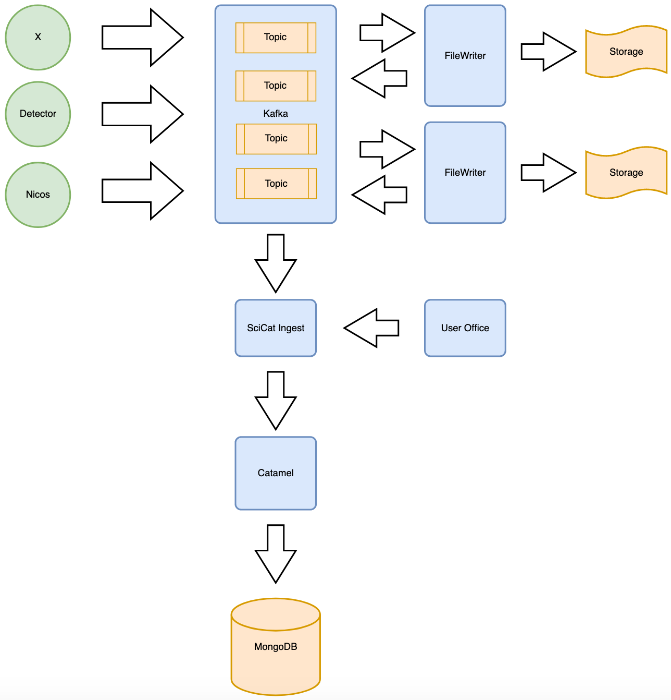

# Ingest Instructions ESS

As shown in the picture above the detector and the data collection software is writing into kafka topics. The topics is then being read by a filewriter that in turn writes the dataset to storage and sends back an event when the file is written. There is than ingestion program that will parse the event, gather information from additional resources and trigger a REST calls into Catamel. 

### How the ingestion program works:

#### Parse Event

The ingestor is subscribing to a topic in Kafka where the filewriter creates an event when a file has been written. This event contains information about location, proposal id and metadata that exist on the file in form of the nexus format. 

#### Login  

 Login and get a access token that can be used for interfacing with Catamel. We advise to create a special ingestor account to be used when doing automatic ingestion. 

#### Gather more metadata

The ingestor contacts the User Office and get's additional information regarding the experiment, the principal investigator and the sample.

#### Create dataset

Using the information from the filewriter event with the additional information gathered from the user office a dataset request can be constructed and sent to Catamel.

#### Create OrigDatablocks

After a dataset has been created we attach the files that relate, this is done by creating datablocks that attaches to the dataset

#### Create Sample

If sample information is available a sample record can be created and attached to the dataset. This is an important step as it makes the data available to a wider audience of people. 