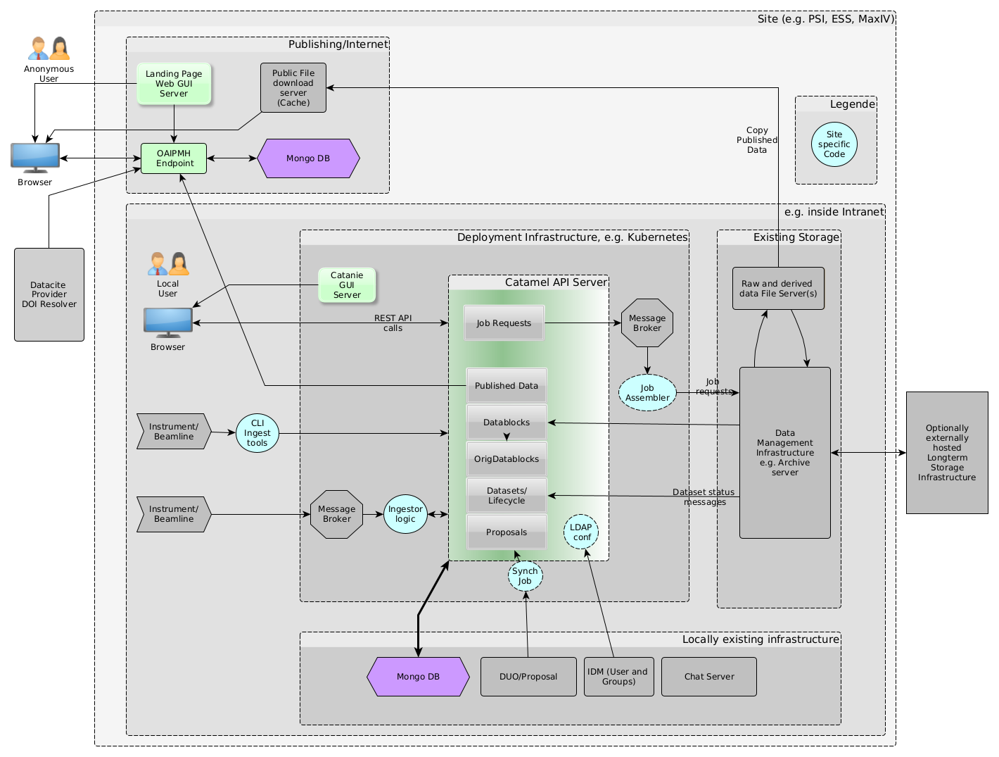

# Overview

Getting SciCat up and running at your site should be rather straight forward for a test deployment. However turning into a production ready system may involve a bit more work, because different existing systems will need to be interfaced to SciCat

## Understanding the Components

For the subsequent sections it will be useful to have a "helicopter" overview of the various components that need to play together seamlessly. The following diagram shows these components and also shows potentially existing components at your site, that you would likely want to interface to SciCat. The specific diagram reflects essentially the situation at PSI as of Sept. 2020. Of course your situation may look different. The diagram should therefore be seen as an *example* , which you need to adapt to your situation.

### Backend

At the heart of the SciCat architecture there is the REST API server [Catamel] (https://github.com/SciCatProject/catamel). This is a  NodeJS application that uses the Loopback 3 framework to generate RESTful APIs from JSON files that define models \(such as: Users, Datasets, Instruments etc\). Following the Swagger/OpenAPI format SDKs can be generated in almost any language.

The persistence layer behind this API server is a [MongoDB](https://www.mongodb.com/) instance, i.e an open source, NoSQL, document-based database solution. The API server handles alll the bi-directional communication from the REST interface to the Database.

These two components together comprise the "backend" of the architecture.

### Frontend

To the REST server an arbitrary number of "clients" (frontends) can be connected. One of the most important clients is the web based GUI frontend [Catanie](https://github.com/SciCatProject/catanie). This allows to communicate with the data catalog in a user friendly way. It is based on the Angular (9+) technology and uses ngrx to communicate with the SciCat API and provide a searchable interface for datasets, as well as the option to carry out actions \(i.e. archiving\).

In addition to the GUI other clients exist, such as command line (CLI) clients (example exist written in GO and Python) or desktop based GUI applications based on Qt. The CLI tools are especially useful for automated workflows, e.g. to get the data into the data catalog. This process is termed "ingestion" of the data. But they can also be used to add the data manually, especially for derived data, since this part of the workflow is often not possible to automate, in particulat in truly *experimental* setups.

### Messaging infrastrcuture 

As a way to loosely couple external systems the API server can be connected to messaging system. In particular RabbitMQ (used at PSI) and Apache Kafka are in use. Such systems can e.g. be used to interface to an tape archive system. To add the specific business logic you can e.g. add your own scripting layer. At PSI however a [Node-RED](https://nodered.org/)  based solution proofed to be a stable and flexible platform for this purpose. NodeRed is a A NodeJS based visual programming tool to handle flows of data from one source to another.

### Publishing Server

In order to publish data you need to run a landing page server and you need to assign DOIs to your published data. Since the API server may be operated in an intranet, with no access to the internet the following architecture was chosen at PSI:

An OAIPMH server is running in a DMZ connected to a local Mongo instance. At publication time the data from SciCat is **pushed** to the external OAI-PMH server.
From this server the landing page server can fetch the information about the published data. Also external DOI systems connect to this OAIPMH server to synchronize the data with the world wide DOI system. 

If a user wants to download the full datasets of the published data, the data is copied from the internal file server to a https file server (acting as a cache file server) , which subsequently allows anaonymous download of the data

### Chat Server as electronic logbook

TODO ESS

### External systems

The most important external system, that you want to connect to is likely your local identity management (IDM) system, e.g. an LDAP or AD based solution. This is usually the source of both the authentication and the authorization information, the latter being realized by simple group membership of the users.

Another important external system, that you may want to connect, is your local proposal handling system (such as DUO at PSI). This defines, which user is allowed to measure at what instrument or beamline at what time. If you do not have such a system you can fill the Proposal Information also by hand, or just leave it empty. If you have such a system you need to write scripts which synchronize the data in these systems with the corresponding tables in the SciCat Database, i.e. the *Proposal* collection

Finally external storage systems, in particular those dealing with storage on tape, are a good candidate of an external system

File servers are another component that you may want to integrate. The SciCat architecture does not require any such connection to the file contents, since it deals with metadata only. However the GUI can link to storage systems, which offer to download data using the https protocol.

### Underlying Infrastructure

You may or may not run the infrastructure as part of a Kubernetes cluster. E.g. at PSI the API server, the GUI application, RabbitMQ and the nodered instances are all deployed to a Kubernetes cluster, whereas the Mongo DB ist kept outside Kubernetes.
Kubernetes is not necessary to have, but can simplify your life quite a bit. Also the separation into internet and intranet zones is up to you to define. You can of course operate the whole infrastructure directly in internet accessible servers, if your security policies permit.

